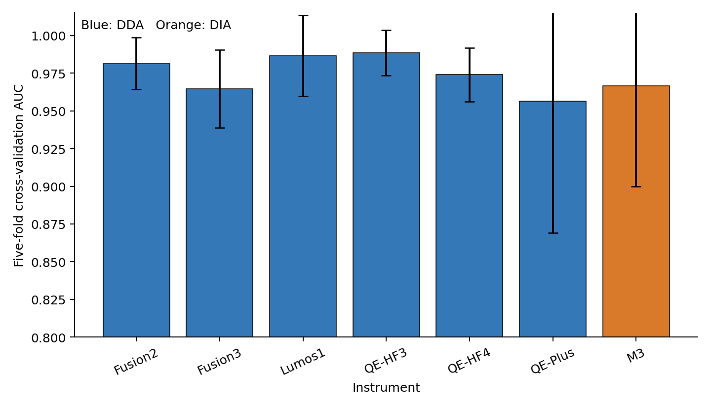

# Instrument-Specific AI Monitoring of Mass Spectrometry QC Samples

This repository contains the code and reported results for instrument-specific quality monitoring of mass spectrometry QC samples. The trained models and large data files are distributed through a companion archive. Six instruments use a DDA preprocessing workflow, while the M3 dataset uses a DIA preprocessing workflow. All instruments use the same downstream VAE+MLP architecture and are trained independently.

## Main results

The published analysis uses five-fold stratified cross-validation for each instrument.

| Instrument | Quantification | Samples | Good | Bad | Mean AUC ± SD |
|---|---|---:|---:|---:|---:|
| Fusion2 | DDA | 120 | 85 | 35 | 0.9814 ± 0.0172 |
| Fusion3 | DDA | 120 | 66 | 54 | 0.9646 ± 0.0257 |
| Lumos1 | DDA | 120 | 76 | 44 | 0.9866 ± 0.0268 |
| QE-HF3 | DDA | 120 | 71 | 49 | 0.9884 ± 0.0151 |
| QE-HF4 | DDA | 120 | 75 | 45 | 0.9740 ± 0.0179 |
| QE-Plus | DDA | 120 | 85 | 35 | 0.9564 ± 0.0872 |
| M3 | DIA | 39 | 30 | 9 | 0.9666 ± 0.0668 |



Open [the overview notebook](notebooks/00_results_overview.ipynb) for the compact result summary. The remaining notebooks provide fold-level metrics and the published ROC figure for each instrument.

## Workflow

```text
DDA abundance matrices -> DDA preprocessing --+
                                              +-> missingness features -> VAE -> MLP -> QC score
DIA peptide table      -> DIA preprocessing --+
```

Both preprocessing workflows create a sample-by-feature matrix with two ordered blocks:

1. missingness after peptide-wise outlier removal;
2. missingness in the original abundance matrix.

The VAE is trained using good QC samples. The MLP then classifies good and bad samples from the eight-dimensional VAE latent mean. A separate model is trained for each instrument.

## Repository contents

```text
scripts/
  preprocess_dda.R       DDA preprocessing
  preprocess_dia.R       DIA preprocessing
  model.py               Shared VAE and MLP implementation
  run_model.py           Training, evaluation, and prediction CLI
config/reported_cv.csv   Settings for the reported cross-validation analyses
notebooks/               Executed result notebooks
results/                 Reported metrics and figures
data/sample_labels.csv   Sample-level labels used in the analysis
data/README.md           Data archive and input format
models/README.md         Trained-model archive and checkpoint format
```

Large input tables, processed feature matrices, and trained `.pt` files are distributed separately and are not committed to Git.

## Installation

Create the Conda environment:

```bash
conda env create -f environment.yml
conda activate ms-qc-monitoring
```

The original analyses were run with Python 3.13, PyTorch 2.6, and R 4.2.

## Start here

### View the reported results

Open:

```text
notebooks/00_results_overview.ipynb
```

The source tables are also available as:

- `results/summary_metrics.csv`
- `results/cv_metrics.csv`

### Re-run cross-validation

The exact per-instrument settings used to generate the reported results are
provided in [`config/reported_cv.csv`](config/reported_cv.csv). Use these
settings with the `evaluate` command in `scripts/run_model.py`.

### Apply a trained model

Download the model and processed example data from the archive listed in [models/README.md](models/README.md), then run:

```bash
python scripts/run_model.py predict \
  --model models/fusion2.pt \
  --input examples/fusion2_missingness_features.csv.gz \
  --output predictions.csv
```

Published checkpoints accept the standardized missingness feature matrix, not vendor-native mass spectrometry files. Each checkpoint stores the required feature names and order, preprocessing profile, architecture, weights, and decision threshold.

### Train on DDA data

```bash
Rscript scripts/preprocess_dda.R \
  --input-dir data/raw/dda \
  --output-dir data/processed

python scripts/run_model.py train \
  --instrument fusion2 \
  --preprocessing-profile dda_missingness_v1 \
  --input data/processed/fusion2/missingness_features.csv \
  --labels data/processed/fusion2/sample_labels.csv \
  --output models/fusion2.pt
```

### Train on DIA data

```bash
Rscript scripts/preprocess_dia.R \
  --input data/raw/dia/peptide_quantities.tsv \
  --labels data/raw/dia/sample_quality_labels.xlsx \
  --output-dir data/processed \
  --instrument m3

python scripts/run_model.py train \
  --instrument m3 \
  --preprocessing-profile dia_missingness_v1 \
  --input data/processed/m3/missingness_features.csv \
  --labels data/processed/m3/sample_labels.csv \
  --output models/m3.pt
```

Use `python scripts/run_model.py --help` and the subcommand help pages for all options.

## Data and model availability

The input data, processed feature matrices, and pretrained checkpoints are
archived on Zenodo (version 1.0.0):

<https://doi.org/10.5281/zenodo.21337993>

The archived files, sizes, and SHA-256 checksums are listed in
`artifacts_manifest.tsv`.

## Citation

Please cite the versioned Zenodo archive above when using the deposited data or
pretrained models. Software citation metadata will be added after the authors
and paper details are confirmed.

## License

Source code is released under the BSD 3-Clause License. Data, result tables, figures, and trained model weights are released under CC BY 4.0 unless otherwise noted. Redistribution of any third-party source data remains subject to its original terms.
